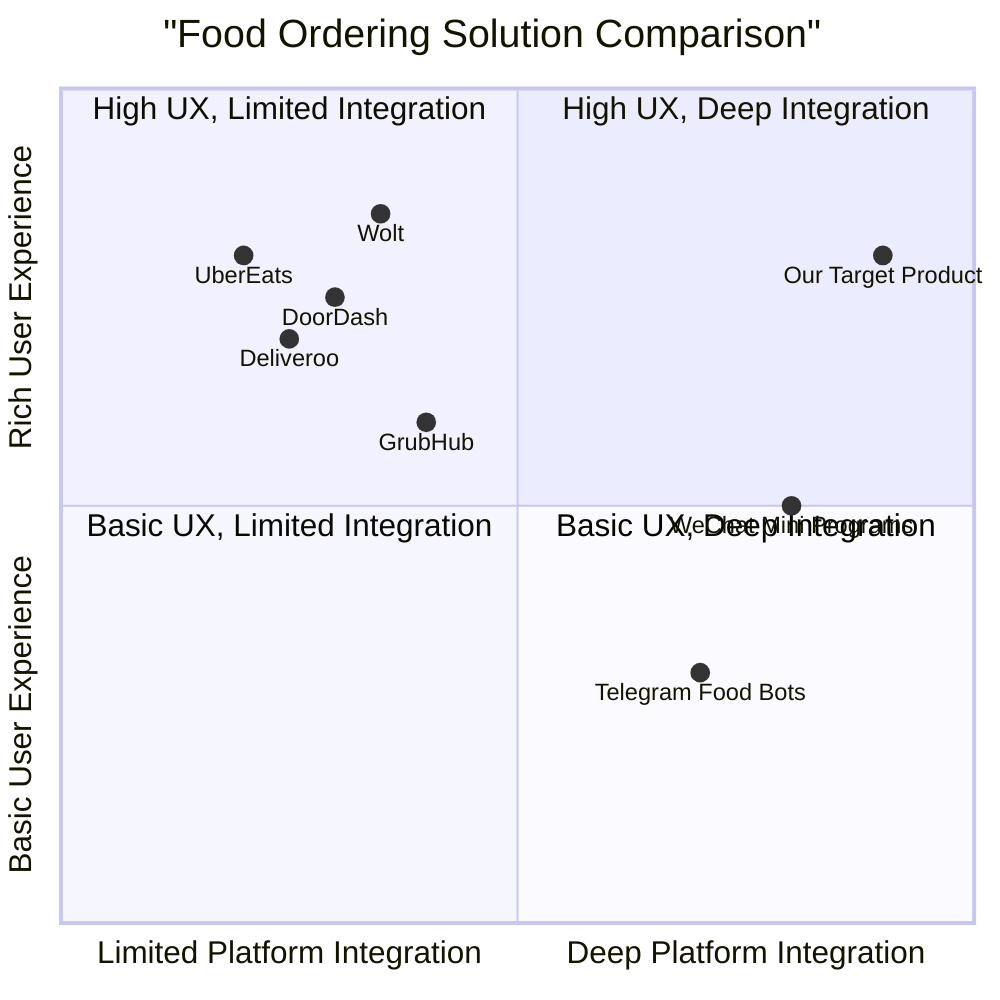
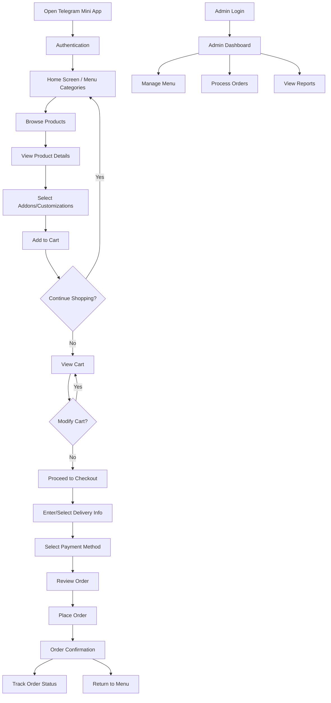
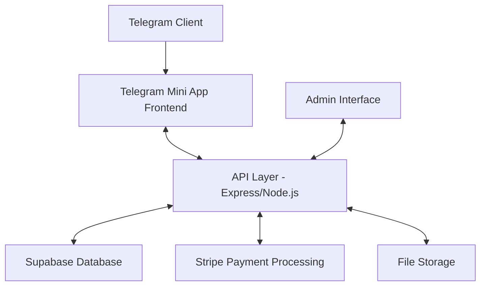

# Product Requirements Document (PRD)

## E-commerce Telegram Mini App for Food Ordering Service

### Document Information
**Date:** 2025-05-18  
**Project Name:** telegram_food_ordering_app  
**Author:** Emma, Product Manager  

### Original Requirements
Develop an E-commerce Telegram Mini App for a food ordering service with the following specifications:

**Technical Stack:**
- Frontend: React + TypeScript + Vite with Shadcn UI and Tailwind CSS for responsive components
- Backend: Node.js with Express for API endpoints
- Database: Supabase for data storage, authentication, and real-time updates
- Payment Processing: Stripe integration for secure checkout
- Deployment: Vercel for both frontend and backend components

**Core Features to Include:**
1. User authentication via Telegram Mini App initData validation
2. Product catalog with categories (Main, Side, Beverages, Paste, Special Set) from Menu.txt
3. Product detail pages with addon selection functionality
4. Shopping cart management with real-time updates
5. Secure checkout process with Stripe
6. Order history and tracking
7. Admin panel for menu and order management

## 1. Product Definition

### Product Goals
1. Create a seamless food ordering experience within the Telegram platform, eliminating the need for users to switch between applications
2. Increase restaurant revenue by providing a frictionless ordering process with personalization options
3. Enhance operational efficiency for restaurant staff through streamlined order management and real-time updates

### User Stories
1. As a hungry customer, I want to browse food categories and view menu items with images so that I can easily find what I'd like to order
2. As a regular customer, I want to customize my food with available addons (spice level, basil preference, etc.) so that my order meets my specific preferences
3. As a busy professional, I want a quick checkout process that remembers my payment details so that I can place orders efficiently
4. As a restaurant owner, I want to manage menu items and track orders in real-time so that I can maintain accurate inventory and ensure timely delivery
5. As a customer who just placed an order, I want to track my order status so that I know when my food will arrive

### Competitive Analysis

| Competitor | Pros | Cons |
|------------|------|------|
| **UberEats** | - Wide restaurant network - Real-time delivery tracking - Established payment system | - High commission fees - Separate app download required - Complex onboarding process |
| **Deliveroo** | - Clean user interface - Exclusive restaurant partnerships - Loyalty program | - Limited geographical coverage - Higher delivery fees - No in-messenger ordering |
| **DoorDash** | - Group ordering capability - Scheduled deliveries - Detailed order customization | - Separate app required - Frequent surge pricing - Complicated refund process |
| **GrubHub** | - Restaurant ratings and reviews - Multiple payment options - Order tracking | - Interface can be cluttered - Customer service delays - Limited international presence |
| **Telegram Food Bots** | - Native to Telegram - Simple conversation flow - No app switching | - Limited visual presentation - Basic customization options - Often text-based interfaces |
| **WeChat Mini Programs** | - Integrated payment - No download required - Social sharing features | - Limited to WeChat ecosystem - Less sophisticated UI/UX - Limited analytics capabilities |
| **Wolt** | - Beautiful UI/UX - Efficient delivery logistics - Discovery features | - Separate app required - Higher prices - Limited to urban areas |

### Competitive Quadrant Chart

## 2. Technical Specifications

### Requirements Analysis
Based on the project goals and user stories, the Telegram Mini App for food ordering requires a responsive, user-friendly interface that integrates seamlessly with the Telegram platform while providing a full-featured e-commerce experience. The application needs to handle user authentication through Telegram, display categorized menu items, allow for detailed customization options, manage the shopping cart in real-time, process payments securely, and provide order tracking capabilities.

The technical implementation will utilize a modern React frontend with TypeScript for type safety and Tailwind CSS with Shadcn UI for responsive design. The backend will be built with Node.js and Express to provide RESTful API endpoints. Supabase will be used for database operations, authentication, and real-time updates, while Stripe will handle secure payment processing. The entire solution will be deployed on Vercel for optimal performance and reliability.

### Requirements Pool

#### P0 (Must Have)
1. **Telegram Authentication**
   - System must validate Telegram Mini App initData for secure user authentication
   - Must store user information (Telegram ID, username) in Supabase
   - Must handle login/logout states appropriately

2. **Product Catalog**
   - Must display all food items categorized as in Menu.txt (Main, Side, Beverages, Paste, Special Set)
   - Must show product images, names, and prices
   - Must implement filtering by category
   - Must enable search functionality

3. **Product Details**
   - Must display comprehensive product information (name, price, image, description)
   - Must allow selection of addons (spice level, basil type, weight, packaging, beverages)
   - Must update price dynamically based on selections
   - Must have an "Add to Cart" button

4. **Shopping Cart**
   - Must display all added items with their customizations
   - Must allow quantity adjustments
   - Must enable item removal
   - Must calculate and display subtotals, taxes, and final price
   - Must persist cart between sessions

5. **Checkout Process**
   - Must integrate with Stripe for secure payments
   - Must collect delivery information
   - Must validate all required fields
   - Must show order summary before final payment
   - Must confirm successful orders

6. **Backend API**
   - Must provide endpoints for all frontend operations
   - Must implement proper error handling
   - Must include security measures (rate limiting, input validation)
   - Must log critical operations

#### P1 (Should Have)
1. **Order History**
   - Should display past orders with details
   - Should allow reordering with one click
   - Should provide order status updates

2. **User Profiles**
   - Should store delivery addresses
   - Should save payment methods (securely via Stripe)
   - Should track order preferences

3. **Real-time Updates**
   - Should provide order status notifications
   - Should update cart in real-time across devices
   - Should show real-time product availability

4. **Admin Panel**
   - Should allow menu management (CRUD operations)
   - Should provide order tracking and management
   - Should generate basic sales reports
   - Should allow availability toggling for products

5. **Performance Optimization**
   - Should implement image optimization
   - Should utilize caching strategies
   - Should minimize loading times

#### P2 (Nice to Have)
1. **Favorites/Wishlists**
   - May allow users to save favorite items or create custom lists

2. **Loyalty Program**
   - May implement points system or rewards
   - May offer discounts for repeat customers

3. **Reviews and Ratings**
   - May allow customers to rate and review products
   - May display average ratings on product cards

4. **Social Sharing**
   - May enable sharing of products or orders via Telegram
   - May include referral system

5. **Advanced Analytics**
   - May provide detailed insights for restaurant owners
   - May include customer behavior analysis

### UI Design Draft

#### Screen Flow
1. **Splash Screen**
   - Telegram Mini App loading indicator
   - Automatic authentication via Telegram

2. **Home Screen**
   - Header with restaurant logo and search icon
   - Horizontal scrolling category tabs (Main, Side, Beverages, etc.)
   - Grid/List toggle for product display
   - Product cards with images, names, and prices
   - Floating cart button with item count and total

3. **Product Detail Screen**
   - Large product image
   - Product name, price, and description
   - Addon selection accordions (Spice Level, Basil, Weight, etc.)
   - Dynamic price updates
   - Quantity selector
   - Add to Cart button
   - Related items carousel

4. **Cart Screen**
   - List of cart items with images, names, quantities, and prices
   - Edit button for each item
   - Remove button for each item
   - Subtotal, tax calculation, and total
   - Proceed to Checkout button

5. **Checkout Screen**
   - Delivery address form/selection
   - Delivery time options
   - Payment method selection
   - Order summary
   - Place Order button

6. **Order Confirmation Screen**
   - Order confirmation message
   - Order tracking number
   - Estimated delivery time
   - View Order Status button
   - Return to Menu button

7. **Order History Screen**
   - List of past orders with dates, totals, and statuses
   - Order detail expansion
   - Reorder button

8. **Admin Panel**
   - Dashboard with key metrics
   - Menu management section
   - Order management section
   - Settings section

### User Flow Diagram

### Open Questions
1. What is the expected daily order volume for the restaurant?
2. Are there any specific delivery zones or restrictions?
3. How should inventory management be handled? Should items be automatically marked as out of stock?
4. What are the current order peak times, and can the system handle the load?
5. Is there a need for multiple language support in the application?
6. What are the specific business KPIs that should be tracked in the admin dashboard?
7. What is the policy for order cancellations and refunds?
8. Are there any specific marketing campaigns or promotions that need to be supported?

## 3. Implementation Strategy

### Development Phases

#### Phase 1: Foundation (Weeks 1-2)
- Set up development environment
- Create project architecture
- Implement Telegram Mini App authentication
- Design database schema in Supabase
- Build basic UI components

#### Phase 2: Core Features (Weeks 3-4)
- Implement product catalog
- Develop product detail pages with addon selection
- Create shopping cart functionality
- Design and implement checkout flow
- Integrate Stripe payment processing

#### Phase 3: Enhancement (Weeks 5-6)
- Develop order history and tracking
- Build admin panel for menu management
- Implement real-time order updates
- Add user profile and saved preferences
- Perform optimization and testing

### Technical Architecture

### Database Schema

#### Tables

1. **users**
   - id (primary key)
   - telegram_id
   - first_name
   - last_name
   - username
   - created_at
   - updated_at

2. **products**
   - id (primary key)
   - product_id (from Menu.txt)
   - name
   - price
   - category
   - image_url
   - description
   - is_available
   - created_at
   - updated_at

3. **addon_categories**
   - id (primary key)
   - name (e.g., "Spicy level", "Basil")
   - applicable_products (array of product_ids)
   - created_at
   - updated_at

4. **addon_options**
   - id (primary key)
   - addon_category_id (foreign key)
   - name (e.g., "Non Spicy", "Thai Holy Basil")
   - price_adjustment
   - is_default
   - created_at
   - updated_at

5. **carts**
   - id (primary key)
   - user_id (foreign key)
   - created_at
   - updated_at

6. **cart_items**
   - id (primary key)
   - cart_id (foreign key)
   - product_id (foreign key)
   - quantity
   - special_instructions
   - created_at
   - updated_at

7. **cart_item_addons**
   - id (primary key)
   - cart_item_id (foreign key)
   - addon_option_id (foreign key)
   - created_at
   - updated_at

8. **orders**
   - id (primary key)
   - user_id (foreign key)
   - status (enum: pending, preparing, delivering, delivered, canceled)
   - subtotal
   - tax
   - delivery_fee
   - total
   - delivery_address
   - delivery_instructions
   - payment_intent_id
   - created_at
   - updated_at

9. **order_items**
   - id (primary key)
   - order_id (foreign key)
   - product_id (foreign key)
   - quantity
   - unit_price
   - subtotal
   - special_instructions
   - created_at
   - updated_at

10. **order_item_addons**
    - id (primary key)
    - order_item_id (foreign key)
    - addon_option_id (foreign key)
    - price_adjustment
    - created_at
    - updated_at

## 4. Acceptance Criteria

### User Authentication
- User can access the app through Telegram
- System validates Telegram initData
- User information is stored securely

### Product Catalog
- All categories from Menu.txt are displayed correctly
- Products show accurate information (name, price, image)
- Filtering works as expected
- Search returns relevant results

### Product Details
- Full product information is displayed
- All applicable addons are shown for each product
- Price updates dynamically with addon selections
- Add to Cart button works correctly

### Shopping Cart
- Items added to cart appear immediately
- Quantity can be adjusted
- Items can be removed
- Cart persists between sessions
- Totals calculate correctly

### Checkout Process
- Delivery information can be entered/selected
- Payment processing with Stripe works securely
- Order confirmation is displayed
- Order is recorded in the system

### Order History
- Past orders are displayed accurately
- Order details can be viewed
- Reordering functionality works

### Admin Panel
- Admin can log in securely
- Menu items can be added, edited, and removed
- Orders can be viewed and status updated
- Reports show accurate data

## 5. Success Metrics

### Business Metrics
- Average order value
- Order frequency
- Customer retention rate
- Revenue growth
- Popular item analysis

### Technical Metrics
- App loading time (target: < 2 seconds)
- Cart abandonment rate
- Checkout completion rate
- Error rate (target: < 1%)
- API response time (target: < 500ms)

## 6. Appendices

### A. Menu Analysis
Based on the provided Menu.txt file, the restaurant offers:
- 4 Main dishes (Beef/Chicken Krapow sets)
- 4 Side items (Individual Krapow, Rice, Fried Egg)
- 1 Special Set (Beef & Chicken Krapow Set)
- 4 Beverage options (Kickapoo, Winter Melon, Soya, Ice Lemon Tea)
- 1 Paste product (Pes Krapow)

Addons are available for specific products:
- Spice level options (Non Spicy to Extra Spicy)
- Basil type options (Thai Holy Basil, Thai Basil, No Basil)
- Weight options (125g default, 250g)
- Packaging options (Photodegradable or Plastic containers)
- Beverage selection for certain combo meals

This structure requires a flexible product customization system that can display different addon options based on the selected product.

### B. Integration Requirements

#### Telegram Mini App Integration
- Follow Telegram Mini App API guidelines
- Implement proper initData validation
- Ensure responsive design within Telegram constraints
- Support deep linking for sharing products/cart

#### Stripe Integration
- Implement Stripe Elements for secure payment collection
- Set up webhook endpoints for payment event handling
- Configure proper error handling and recovery
- Implement payment intent confirmation flow

#### Supabase Integration
- Design efficient database schema
- Implement row-level security policies
- Configure real-time subscriptions for order updates
- Set up authentication flows

### C. Glossary
- **Telegram Mini App**: A web application that runs inside the Telegram messenger
- **initData**: Encrypted data passed from Telegram to verify user authenticity
- **Krapow**: Thai basil stir-fry dish, a specialty of this restaurant
- **Addon**: Customization option for a food item
- **Stripe**: Payment processing platform
- **Supabase**: Backend-as-a-service platform for database, auth, and real-time features
- **Vercel**: Deployment and hosting platform
